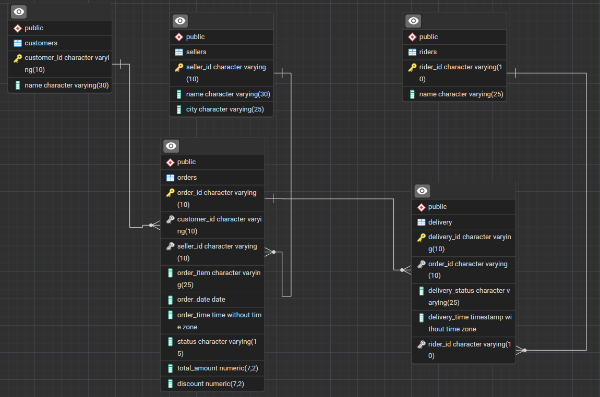

# E-commerce Database SQL Queries

This repository contains a comprehensive collection of SQL queries designed for an e-commerce database. The queries are categorized by difficulty (Easy, Medium, and Hard) and address various common data retrieval and manipulation tasks within an e-commerce ecosystem. This project serves as a practical demonstration of SQL proficiency in managing customer orders, seller information, rider deliveries, and overall order processing. It can be used for learning, testing, or as a foundation for building more complex e-commerce functionalities.

## Database Design



## Running Instructions (Docker)

- **Run Docker Compose File:**

  ```bash
  docker compose up -d
  ```

- **For running commands in psql:**
  ```bash
  docker-compose exec -it db psql -U user -d postgres
  ```
- **Exit psql:**
  ```bash
  exit
  ```
- **Stop and remove volume of container:**

  ```bash
  docker compose down -v
  ```

- **Connect to the adminer UI:**
  You can connect to PostgreSQL UI adminer at `https://localhost:8080` with the credentials configured in the `docker-compose.yaml` file.

## SQL Queries

**1. Find the customer_name who placed the order with the highest total_amount, and the order_item for that order.**

```sql
SELECT c.name AS customer_name, o.order_item
FROM customers c
JOIN orders o ON c.customer_id = o.customer_id
WHERE o.total_amount = (SELECT MAX(total_amount) FROM orders);
```

**2. List the rider_name and the total number of deliveries they have completed with a 'Delivered' status, ordered by the number of deliveries in descending order.**

```sql
SELECT r.name AS rider_name, COUNT(d.delivery_id) AS delivered_count
FROM riders r
JOIN delivery d ON r.rider_id = d.rider_id
WHERE d.delivery_status = 'Delivered'
GROUP BY r.name
ORDER BY delivered_count DESC;
```

**3. Determine the seller_city that has the highest average discount across all orders originating from that city.**

```sql
SELECT s.city, AVG(o.discount) AS average_discount
FROM sellers s
JOIN orders o ON s.seller_id = o.seller_id
GROUP BY s.city
ORDER BY average_discount DESC
LIMIT 1;
```

**4. Identify customer_ids who have placed orders for more than one unique order_item, along with the count of unique order_items they have purchased.**

```sql
SELECT customer_id, COUNT(DISTINCT order_item) AS unique_items_count
FROM orders
GROUP BY customer_id
HAVING COUNT(DISTINCT order_item) > 1;
```

**5. Find the customer_id and name of customers who placed orders with a 'Delivered' status.**

```sql
SELECT c.customer_id, c.name
FROM customers c
NATURAL JOIN orders o
NATURAL JOIN delivery d
WHERE d.delivery_status = 'Delivered';
```

**6. Calculate the average total_amount for orders placed on '2025-07-29'.**

```sql
SELECT AVG(total_amount)
FROM orders
WHERE order_date = '2025-07-29';
```

**7. List the order_id and delivery_status for orders that are currently 'In Transit' or 'Out for Delivery'.**

```sql
SELECT order_id, delivery_status
FROM delivery
WHERE delivery_status IN ('In Transit', 'Out for Delivery');
```

**8. Find the seller_name and the number of orders they have processed.**

```sql
SELECT s.name, COUNT(o.order_id) AS number_of_orders
FROM sellers s
NATURAL JOIN orders o
GROUP BY s.name;
```

**9. Retrieve the order_id, order_item, and seller_name for all orders, joining the order and seller tables.**

```sql
SELECT o.order_id, o.order_item, s.name
FROM orders o
JOIN sellers s ON o.seller_id = s.seller_id;
```

**10. List the order_id and order_item for all orders that have a total_amount greater than 500.**

```sql
SELECT order_id, order_item
FROM orders
WHERE total_amount > 500;
```

**11. Find the name of all riders.**

```sql
SELECT name
FROM riders;
```

**12. Get the seller_name and seller_city for all sellers located in 'Mumbai'.**

```sql
SELECT name, city
FROM sellers
WHERE city = 'Mumbai';
```

**13. Count the total number of orders in the order table.**

```sql
SELECT COUNT(order_id)
FROM orders;
```

**14. Retrieve all distinct delivery_status values from the delivery table.**

```sql
SELECT DISTINCT delivery_status
FROM delivery;
```
